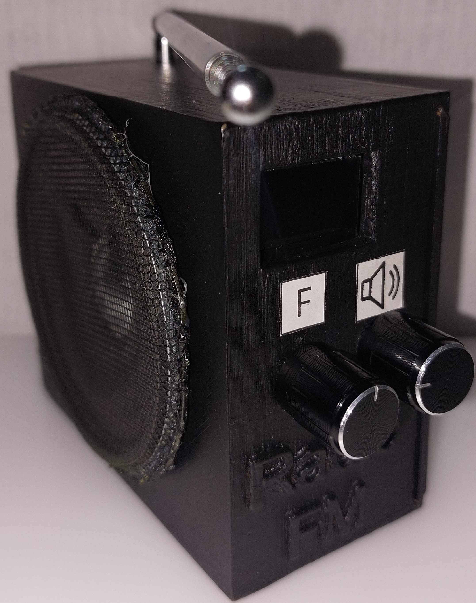
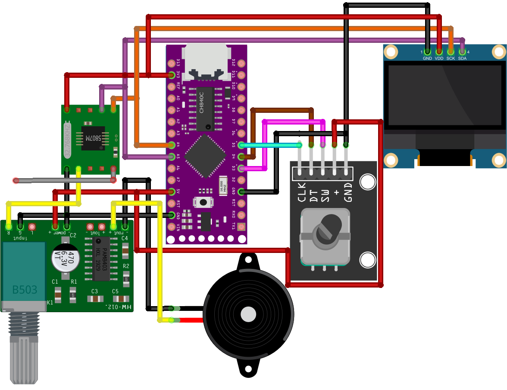

# FM Radio Receiver Project

This project is an FM radio receiver based on Arduino programming language, using the LGT8F328P microcontroller, the RDA5807M receiver module, a 0.96" OLED display, and a rotary encoder.

In this repository, you will find the schematic of the circuit and the code required for this project.

## Project Overview

For receiving , we use the FM module RDA5807M with the LGT8F328P microcontroller and a 0.96" OLED [128×64] pixel I2C display to show the frequency received by the radio. The reception is done within the authorized FM band authorized [88–108] MHz. To switch frequencies and change the received stations, we use the KY-040 rotary encoder. Finally, to amplify the received signal, we use the PAM8403 amplifier, which is connected to a speaker so that the received audio can be heard.

## Script Explanation

The first step in the script is to declare the necessary libraries as follows:
- `<Wire.h>` for I2C communication.
- `<Adafruit_SSD1306.h>` and `<Adafruit_GFX.h>` for controlling the OLED display.
- `<BfButton.h>` for controlling the encoder button.
- `<RDA5807.h>` and `<radio.h>` for managing the RDA module.

Next, we declare the variables, including the pins used, the frequency value, the maximum and minimum frequencies, variables for the state of the encoder, and the specifics of the models. Various functions are defined to control the system, and the OLED screen and RDA module are initialized.

The system starts by displaying the FM radio logo and tunes to the initial frequency of 98 MHz with a 100 kHz step, displaying the current frequency.

The system control involves several conditions managed by the encoder button:
- A single click jumps to the maximum frequency of 108 MHz.
- A double click sets the frequency to the minimum of 88 MHz.
- A long click can change the step from 100 kHz to 1 MHz or vice versa.

The second block of conditions is controlled by the rotation of the encoder:
- Rotating to the right adds the step to the current frequency.
- Rotating to the left subtracts the step from the current frequency.

Before sending the frequency value to the RDA module, a final condition ensures that the received frequency is within the desired range of [88-108] MHz. If it exceeds this range, it will revert to the minimum frequency; if it is below, it will jump to the maximum.

The obtained frequency value is then sent to the radio module and displayed on the OLED screen.
